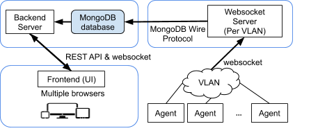
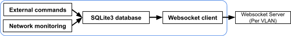

# Technical Specification of Network Monitoring Tool
###### Columbia University, the Internet Real-Time Laboratory (IRT Lab), 2018-2019.

## 1 Introduction
This document provides technical specification of Network Monitoring Tool. It
provides system architecture of the tool, databases design (SQLite3 and MongoDB),
how different services talk to each other and how to debug system.<br/>

## 2 System Architecture
The entire system consists of four parts (See Pic 1. for the project architecture):
1. Network monitoring Agent, that should be installed and run on the Phoenix Box.
   Note that one Phoenix Box can have more than one installed agent.
2. MongoDB database and Websocket server. Agents establish connection with
   websocket server and periodically (every 2 seconds) send monitoring data.
   Websocket server processes received data and stores on the MongoDB database.
3. Backend server. It reads data from MongoDB database, provides REST API and
   Websocket API to web interface (UI).
4. Web interface (UI). It just receives/gets data via http requests and
   websocket, and shows in user interface.

<br/>

<br/>
Pic 1.<br/>

## 3 Agent
Agent consists of three parts: (See Pic 2.):
1. Network monitoring. It does network monitoring (discover devices, scanning
   devices, scanning TCP & UDP ports, running external commands) and stores data
   on the SQLite3 database.
2. Websocket Client reads data from SQLite3 database and sends to MongoDB &
   Websocket Server periodically (every 2 seconds). Note that if any single row
   of the SQLite3 database is not updated it will not send.
3. SQLite3 database where is stored all gathered data.

<br/>

<br/>
Pic 2.<br/>

If connection between Agent’s Websocket Client and Websocket Server is
interrupted by a third party or because of some other problems, it always tries
to establish a connection. An Agent always stores data on the database even if
there is no connection. As soon as connection is established websocket sends
remained data as it sends data based on timestamp. Websocket connection is
encrypted with TLS.

## 3.1 SQLite3 Database Design
SQLite3 is a relational database management system. It provides a lightweight
disk-based database that does not require a separate server process and allows
accessing the database using a nonstandard variant of the SQL query language.
Database (file is in ```/var/local/agent_sqlite3.db```) has five tables;
`node_id`, `agent_devices`, `net_interface_data`, `link_data`, and `ids_data`.<br/>

###### Schema of `node_id` table <br/>

| Column name | SQLite3 type | Description |
| --- | --- | :------- |
| timestamp | TEXT | UTC time in ISO format. This shows when Agent was run for the first time.|
| device_id | TEXT | Device unique ID is value of SHA1(hostname).|

###### Schema of `agent_devices` table <br/>

| Column name | SQLite3 type | Description |
| --- | --- | :------- |
| mac | TEXT (PRIM. KEY) | MAC address of discovered device.|
| ip | TEXT  | IPv4 address of discovered device.|
| hostname | TEXT  | Hostname of discovered device.|
| iface | TEXT  | Network interface name of discovered device.|
| last_update | REAL | Last update shows last ARP request in Unix Epoch time in milliseconds.|
| registration_ts | REAL | When device was discovered for the first time. Unix Epoch time in milliseconds.|
| open_tcp_ports | TEXT  | Space separated open TCP port numbers.|
| last_tcp_update | REAL | Last update shows last TCP port scanning in Unix Epoch time in milliseconds.|
| open_udp_ports | TEXT | Space separated open UDP port numbers.|
| last_upd_update | REAL | Last update shows last TCP port scanning in Unix Epoch time in milliseconds.|

###### Schema of `net_interface_data` table <br/>

| Column name | SQLite3 type | Description |
| --- | --- | :------- |
| iface | TEX (PRIM. KEY) | Network interface name.|
| mac | TEXT | MAC address of a network interface.|
| ip | TEXT | IPv4 address of network interface.|
| tx_bytes | INTEGER | Total transmitted bytes.|
| tx_packets | INTEGER | Total transmitted packets.|
| tx_dropped | INTEGER | Total dropped packets.|
| rx_bytes | INTEGER | Total received bytes.|
| rx_packets | INTEGER | Total received packets.|
| rx_dropped | INTEGER | Total dropped packets.|
| last_update | REAL | Last updated of database. Unix Epoch time in milliseconds.|

###### Schema of `link_data` table <br/>

| Column name | SQLite3 type | Description |
| --- | --- | :------- |
| status | TEXT | Status of link.|
| src_ip | TEXT | Source IPv4 address.|
| src_mac | TEXT | Source MAC address.|
| dst_ip | TEXT | Destination IPv4 address.|
| dst_mac | TEXT | Destination MAC address. This is always an empty.|
| timestamp | TEXT | Last update in UTC ISO format.|
| attributes | TEXT | This is JSON string. {'_o': “olsrd”, '_v': 1, 'linkQuality': <value>,}|

###### Schema of `ids_data` table
| Column name | SQLite3 type | Description |
| --- | --- | :------- |
| ip | TEXT | IPv4 address of attacker.|
| blocked | INTEGER | 1 if device is blocked, otherwise 0.|
| blocked_on | INTEGER | UNIX Epoch time in seconds. This can be 0.|
| danger_level | INTEGER | Danger level of attack. An integer number 1 to 5.|
| attributes | TEXT | This is JSON string.|
| last_update | REAL | Last update on the database in UNIX Epoch time in seconds.
<br/>

### 3.2 Source Code Design
###### TODO <br>

### 4 MongoDB Database & Websocket Server
Websocket Server processes received data from Agents and stores on the MongoDB
database.

### 4.1 MongoDB Database Design
MongoDB database consists of collections (tables in relational database systems),
and one collection can have more than one document, where document is JSON object.
MongoDB database has six collections (first three are the most important collections):
`agents_col`, `ifaces_data_col`, `ids_data_col`, `vlan_traffic_ts_col`,
`notifications_col` and `ids_notifications_col`.<br/>

###### Document schema of `agents_col` collection

| JSON key | Value type | Description |
| --- | --- | :------- |
| id | String | SHA1(hostname) value of Agent’s hostname.|
| status | String | Device status. It is up, down or congested.|
| type | String | It is set Phoenix Box for Agent.|
| mac | String | MAC address of Agent.|
| ip | String | IPv4 address of Agent.|
| hostname | String | Hostname of Agent.|
| iface | List | List of network interfaces’ name.|
| vlan | String | VLAN name.|
| last_update | Number | UNIX Epoch time in milliseconds.|
| registration_ts | Number | UNIX Epoch time in milliseconds.|
| open_tcp_ports | List | List of open TCP port numbers.|
| last_tcp_update | Number | UNIX Epoch time in milliseconds.|
| open_udp_ports | List | List of open UDP port  numbers.|
| last_udp_update | Number | UNIX Epoch time in milliseconds.|
| visible_devices | JSON object | See Visible Devices Table for JSON object format.|
| link_data | Array | An array of JSON objects. See Link Data Table for single JSON object format.|

###### Visible Devices Table
Visible devices format is following JSON object {<device_mac>: device_data, ...}
Where device_mac  is MAC address of device and device_data is JSON object. See
table below for details:

| JSON key | Value type | Description |
| --- | --- | :------- |
| id | String | A unique ID of device.|
| status | String | Device status. It is up, down or congested.|
| type | String | It is set Device.|
| mac | String | MAC address of device.|
| ip | String | IPv4 address of device.|
| hostname | String | Hostname of device.|
| iface | String | Network interface name of device.|
| vlan | String | VLAN name.|
| last_update | Number | UNIX Epoch time in milliseconds.|
| registration_ts | Number | UNIX Epoch time in milliseconds.|
| open_tcp_ports | List | List of open TCP port numbers.|
| last_tcp_update | Number | UNIX Epoch time in milliseconds.|
| open_udp_ports | List | List of open UDP port  numbers.|
| last_udp_update | Number | UNIX Epoch time in milliseconds.|

###### Link Data Table

| JSON Key | Value type | Value Description |
| --- | --- | :------- |
| status | String | Link status. It is up, low, medium or down.|
| src_id | String | Unique ID of source device.|
| src_ip | String | An IPv4 address of source node.|
| src_mac | String | A MAC address of source node (optional).|
| dst_id | String | Unique ID of destination device.|
| dst_ip | String | An IPv4 address of the destination node.|
| dst_mac | String | A MAC address of the destination node.|
| timestamp | String | The timestamp of the measurement in UTC.| 
| attributes | JSON String | “{link_quality: <>, bandwidth: <>,...}”|

###### Document schema of `ifaces_data_col` collection

| JSON key | Value type | Description |
| --- | --- | :------- |
| _id | String | An agent ID. Value of SHA1(hostname).|
| vlan | String | VLAN name.|
| iface_data | JSON object | See Iface Data Table for JSON format.|
| last_update | Number | Document’s last update in UNIX Epoch time in milliseconds.|

###### Iface Data Table
Iface data format is following JSON object {<iface>: iface_data, ...}
Where iface is network interface name and iface_data is JSON object. See below table for details.

| JSON key | Value type | Description |
| --- | --- | :------- |
| mac | String | MAC address of a network interface.|
| ip | Sting | IPv4 address of network interface.|
| tx_bytes | Number | Total transmitted bytes.|
| tx_packets | Number | Total transmitted packets.|
| tx_dropped | Number | Total dropped packets.|
| rx_bytes | Number | Total received bytes.|
| rx_packets | Number | Total received packets.|
| rx_dropped | Number | Total dropped packets.|
| last_update | Number | Last update of above data in UNIX Epoch time in milliseconds.|

###### Document schema of `ids_data_col` collection

| JSON key | Value type | Description |
| --- | --- | :------- |
| _id | String | An agent ID. Value of SHA1(hostname).|
| vlan | String | VLAN name. | ids_events | Array of JSON objects See IDS Event Table for single JSON format.|
| last_update | Number | Document’s last update in UNIX Epoch time in milliseconds.|

###### IDS Event Table

| JSON key | Value type | Description |
| --- | --- | :------- |
| ip | String | IPv4 address of attacker.|
| blocked | Number | 1 if device is blocked, otherwise 0.|
| blocked_on | Number | UNIX Epoch time in seconds. This can be 0.|
| danger_level | Number | Danger level of attack. An integer number 1 to 5.|
| attributes | String | This is JSON string.|
| last_update | Number | Last update on the database in UNIX Epoch time in seconds.|
<br/>

### 4.2 Source Code Design
###### TODO

### 5 Backend Server
Backend Server consists of three parts (See Pic 3.):
1. NGINX proxy for serving https and websocket requests.
2. ExpressJS (webserver application framework for Node.js) as a REST API.
   The main purpose of ExpressJS is to handle user https requests made by the
   control center and provides data to web interface
3. Websocket API. The main purpose of Websocket server is to feed data to user
   interface in real time (actually, every 2 seconds).

Note that, HTTP and Websocket connections are secure the connections are
encrypted with Transport Layer Security (TLS). For secure HTTP it is  HTTPS and
for secure Websocket it is WSS.

<br/>
Pic 3.<br/>


### 5.1 Source Code Design
###### TODO

### 6 Frontend (UI)
User interface (UI) side has its own separate technical documentation.

### 7 Debugging
Debugging part has its own separate documentation.


